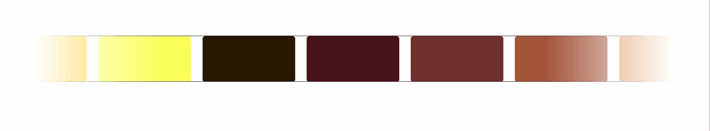
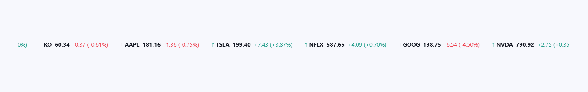

# :rocket: Infinite Marquee Carousel

<!-- İçindekiler -->
## :book: İçindekiler
- [Proje Hakkında](#bulb-proje-hakkında)
- [Carousel Örnekleri](#carousel_horse-carousel-örnekleri)
	1. [Demo - HTML & CSS](#1-demo---html--css) - (Container Bazlı, Kopyala-Yapıştır ile)
	2. [Demo - HTML & CSS](#2-demo---html--css) - (İtem Bazlı, Kopyala-Yapıştır Olmadan)
	3. [Demo - HTML & CSS & Flexbox](#3-demo---html--css--flexbox)
	4. [Demo - Owl Carousel 2](#4-demo---owl-carousel-2)
		- [Owl Carousel - Basic Infinite](#1-owl-carousel---basic-infinite)
		- [Owl Carousel - AutoWidth Problem](#2-owl-carousel---autowidth-problem)
		- [Owl Carousel - AutoWidth Fix](#3-owl-carousel---autowidth-fix)
	5. [Demo - Swiper JS](#5-demo---swiper-js)
- [Katılım ve Katkıda Bulunma](#handshake-katılım-ve-katkıda-bulunma)


<!-- Proje Hakkında -->
## :bulb: Proje Hakkında

**Infinite Marquee Efect (Kayan Efekt)**, güzel bir görünüm elde etmek için 
Web sitelerinde çoğunlukla kullanılan bir efekttir.

Bu efekti yapabilmek adına HTML etiketi olan `<marquee>` kullanılmaktaydı. Ancak HTML 4.0 ile birlikte kullanımdan kaldırıldı. Tarayıcıların bazı sürümleri hala render ediyor olsa da resmi olarak kullanımı tavsiye edilmez ve burada da buna yer verilmemiştir.

`<marquee>` elementinin kullanımdan kaldırılmasıyla birlikte bu efekti yapmak için HTML & CSS veya farklı kütüphaneler kullanılmaya başlandı.

Buradaki amacımız bu efekti yapabilmek adına farklı çözümler sunmaktır. Gerek saf HTML ve CSS olsun gerek farklı kütüphanelerin kullanımı olsun bu projede pek çok örnek yapılarak bir carousel koleksiyonu oluşturulmuştur.

<!-- Carousel Örnekleri -->
## :carousel_horse: Carousel Örnekleri

Proje açıklamaları hem aşağıda verilmiş, kod açıklamaları ise yorum satırlarıyle her demo içerisinde yapılmıştır.

Kodlarda değişiklikler yaparak dilediğiniz gibi özelleştirebilirsiniz.

Projede toplam 5 demo vardır.

<!-- 1. Demo - HTML & CSS -->
## 1. Demo - HTML & CSS
- HTML ve CSS kullanılmıştır
- CSS `@keyframes` kullanılarak marquee efekti uygulanmıştır.
- Aniamsyonun pürüzsüzlüğü için içeriğin aynısı kopyala yapıştır şeklinde eklenmiştir. Kopyala yapıştır yapmak istemeyenler için de JS ile bunu yapabilceği kod verilmiştir. 
- Container bazlı kaydırma uygulanmıştır.
- Hover ile durdurma ve tekrar başlatma mümkündür.
- Slide'in başlangıç ve bitiş noktalarına da kaybolma efektleri uygulanmıştır.
- Responsive tasarım göz önünde bulundurlmuştur.
- [Canlı Önizleme](https://abdullah-bahar.github.io/Infinite-Marquee-Carousel/01-Demo/)

<br>


<!-- 2. Demo - HTML & CSS -->
## 2. Demo - HTML & CSS
- HTML ve CSS kullanılmıştır.
- CSS `@keyframes` kullanılarak marquee efekti uygulanmıştır.
- Animasyon pürüzsüzlüğü için kopyala yapıştıra gerek kalmadan her şey hesaplanmıştır
- Slide'in başlangıç ve bitiş noktalarına da kaybolma efektleri uygulanmıştır.
- İtem bazlı kaydırma uygulanmıştır.
- Slide'in başlangıç ve bitiş noktalarına da kaybolma efektleri uygulanmıştır.
- Negatif değerli `animate` uygulanarak sayfa açıldığında içeriğin dolu olması sağlanmıştır.
- Responsive tasarım göz önünde bulundurlmuştur.
- [Canlı Önizleme](https://abdullah-bahar.github.io/Infinite-Marquee-Carousel/02-Demo/)

<br>



<!-- 3. Demo - HTML & CSS & Flexbox -->
## 3. Demo - HTML & CSS & Flexbox
- HTML, CSS ve Flexbox kullanılmıştır.
- CSS `@keyframes` kullanılarak marquee efekti uygulanmıştır.
- `ul` öğesi altındaki `li` elemanalrı için efekt uygulanmıştır.
- Animasyon pürüzsüzlüğü için kopyala yapıştır yapılan yere `aria-hidden="true"` eklenerek Screen Reader'lar için erişilebilirlik gözetilmiştir.
- Responsive tasarım göz önünde bulunduurlmuştur.
- [Canlı Önizleme](https://abdullah-bahar.github.io/Infinite-Marquee-Carousel/03-Demo/)

<br>




<!-- 4. Demo - Owl Carousel 2 -->
## 4. Demo - Owl Carousel 2
- HTML, CSS ve Owl Carousel kütüphanesi kullanılmıştır.
- Owl Carousel Sürüm : `v2.3.4`
- JQuery Sürüm : `v3.7.1` (Owl Carousel Bağımlılığı)
- Responsive tasarım göz önünde bulunduurlmuştur.
- Bu demo karşılaşılan problemlere yaklaşımı göstermek adına 3 adet demo içermektedir.
- Daha fazla bilgi için [Owl Carousel](https://owlcarousel2.github.io/OwlCarousel2/)'ın sitesini ziyaret edebeilirsiniz.

<!-- 1. Owl Carousel - Basic Infinite -->
### 1. Owl Carousel - Basic Infinite
- Owl Carousel başlatıcı için `responsive` ayarları yapıldı.
- Owl Carousel'in kendi CSS ayarlarına müdahele edilerek marquee efekti uygulandı.

```css
.owl-stage {
	transition-timing-function: linear !important;
}
```
- **Problemler :**
	- Carousel başlarken `autoplayTimeout`2 verilen değer kadar bekliyor sonra dönmeye başlıyor. Yani dönemsi için gecikme yaşanıyor.
	- Carousel için eklenen elemanların boyutu aynı olmadığı için elemanlar arası boşluk eşit gözükmüyor.
- [Canlı Önizleme](https://abdullah-bahar.github.io/Infinite-Marquee-Carousel/04-Demo/01-Basic-Infinite/)

<br>


<!-- 2. Owl Carousel - AutoWidth Problem -->
### 2. Owl Carousel - AutoWidth Problem
- Owl Carousel başlatıcısı için `autoWidth` değeri uygulanarak farklı genişliğe sahip elemanlar olsa da aralarındaki boşluk eşit dağılmıştır.
- `autoWidth` değeri kullanıldığı için `responsive` değerleri otomatik olarak ayarlandı. `responsive` ayarı eklenmesine gerek kalmadı.
- **Problemler :**
	- Carousel başlarken `autoplayTimeout`'e verilen değer kadar bekliyor sonra dönmeye başlıyor. Yani dönemsi için gecikme yaşanıyor.
	- Elemanların genişlikleri farklı olduğu için slider akışında hızlanma ve yavaşlama gerçekleşiyor. Baş döndürücü bir durum.
		- **Örnek :** 
			- Eleman başına dönme hızı : 5000
			- 2000 genişliğe sahip eleman için 5000 değerinde bir dönmeyi yavaş tamamlar.
			- 5000 genişliğe sahip eleman için 5000 değerinde bir dönmeyi hızlı tamamlar.
- [Canlı Önizleme](https://abdullah-bahar.github.io/Infinite-Marquee-Carousel/04-Demo/02-AutoWidth-Problem/)

<br>


<!-- 3. Owl Carousel - AutoWidth Fix -->
### 3. Owl Carousel - AutoWidth Fix
- Yukarıdaki yaşanan problemlere çözüm adına Owl Carousel kütüphanesini JS ile müdahle edilmiştir.
- Elemanlar için dönme hızı için verilen `autoplayTimeout` static değeri kaldırıldı. Onun yerine px/sn şeklinde hesaplama yapan dinamik hız ayarlaması eklenerek yukarıda yaşanan hızlanıp yavaşlama sorunu giderilmiştir.
- Dönme hızı manuel olarak ayarlandığı için Carousel başlarken her hangi bir gecikme artık yaşanmamaktadır. 
- [Canlı Önizleme](https://abdullah-bahar.github.io/Infinite-Marquee-Carousel/04-Demo/03-AutoWidth-Fix/)

<br>


<!-- 5. Demo - Swiper JS -->
## 5. Demo - Swiper JS
- HTML, CSS ve Swiper JS kütüphanesi kullanılmıştır.
- Swiper JS Sürüm : `v12.0.1`
- Owl Carousel'de yaşanan sorunları gidermek adına kütüphane kodlarına yapılan müdahele gibi her hangi bir müdahele yapmadan Swiper başlatıcısının bize tanımış olduğu özellikler kullanılarak marquee efekti kolayca yapılmıştır.
- Çift yönlü efekt uygulanmıştır.
- Slider elemanları için `overlay` uygulanarak modern tasarım amaçlanmıştır.
- Elemanlarda kullanılan görseller [Random User Generator](https://randomuser.me/)'dan alınmıştır
- Daha fazla bilgi için [Swiper JS](https://swiperjs.com/)'in sitesini ziyaret edebeilirsiniz.
- [Canlı Önizleme](https://abdullah-bahar.github.io/Infinite-Marquee-Carousel/05-Demo/)

<br>


<!-- Katılım ve Katkıda Bulunma -->
## :handshake: Katılım ve Katkıda Bulunma

Proje kapsamında yapılan yazım hataları, kodla ilgili sorun ve hataları, yeni demo fikirleri, efekt önerileri veya farklı kütüphane çözümleri varsa öneri de bulunmaktan çekinmeyin.

Tüm bunlar bir fork uzağınızda :)